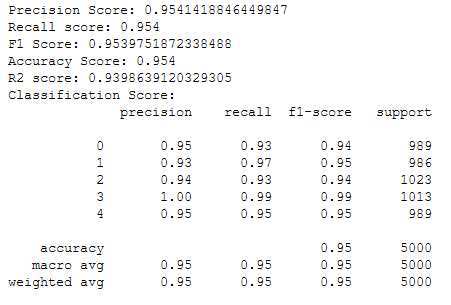
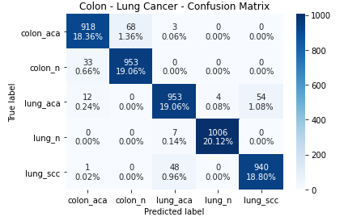

Performed image classification on lung and colon cancer histopathological images acquired on LC25000 dataset through Capsule networks. CapsNets is a concept introduced by Geoffrey Hinton. Capsule networks are a type of ANNs that can be used to better model hierarchical relationships. 

The histopathological images appear as below: 

Through Capsule network, the accuracy in identifying the correct class is close to 95%. Please refer to the metrics below. 

